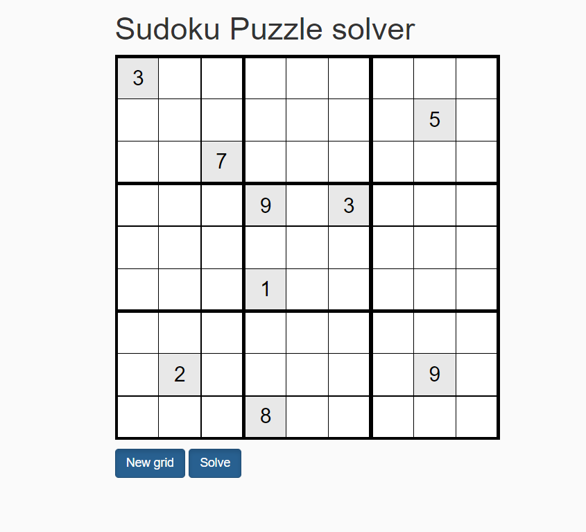
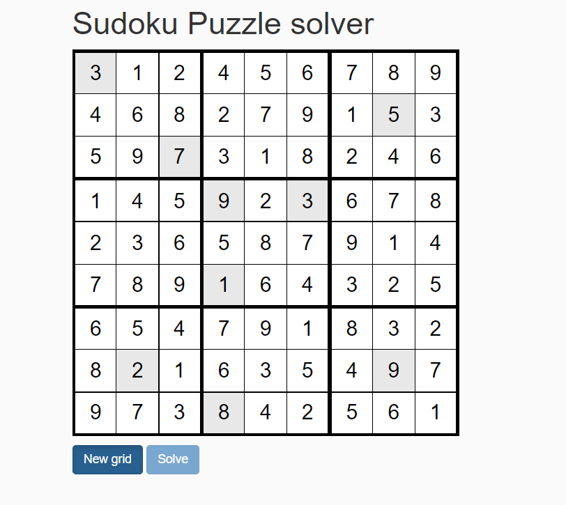
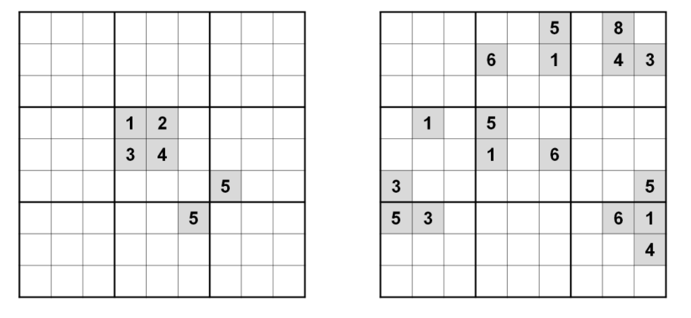

# Sudoku Solver

In this repository, we find a tool develop in javascript to solve a sudoku puzzle.

# Table of contents

- [Getting started](#getting-started)
- [Getting started](#getting-started)
- [Getting started](#getting-started)





## Algorithm

The goal of Sudoku is to full a 9x9 grid where each row, column and 3x3 region contains each of the numbers from 1 to 9.

### General

To resolve a sudoku we use the backtracking algorithm. Our Sudoku solver only needs to follow three strategies:

1. If a grid cell has only one possible value, place that value there.
2. if a grid cell has more than one possible value, place the first one
3. If neither 1 or 2 is true in the entire grid, make a guess. Backtrack if the Sudoku becomes unsolvable.

In our algorithm, I used three main functions are used in the solver. 


#### Controle value in row :

```js
function isValueNotExistInLine(value, lineNumber) {

    for (let j=0; j < 9; j++) {
        if (value == this.cells[lineNumber][j]) {
            return false;
        }
    }

    return true;
}
```

#### Controle value in column :

```js
function isValueNotExistInColumn(value, columnNumber) {
    for (let i=0; i<9; i++) {
        if (value == this.cells[i][columnNumber]) {
            return false;
        }
    }

    return true;
}
```

#### Controle value bloc :

```js
function isValueNotExistInBloc(value, lineNumber, columnNumber) {

    const kline = 3 * Math.trunc(lineNumber/3);
    const kcolumn = 3 * Math.trunc(columnNumber/3);

    for(let i=kline; i < kline + 3; i++) {
        for (let j=kcolumn; j < kcolumn + 3; j++) {
            if (value == this.cells[i][j]) {
                return false;
            }
        }
    }

    return true;
}
```
#### The solver : 

The function accept two parameter. The index of line and the index of colum. We begin by the solve(0, 0).

```js
function solve(row, column) {
    //the stop condition
    if (8 == row && 9 == column) return true;

    if (column == 9) {
        row++;
        column = 0;         
    }

    if (0 != this.cells[row][column]) {
        return this.solve(row, column + 1);
    }

    for (let number = 1; number < 10; number++) {
        
        if (this.isValueNotExistInBloc(number, row, column) && this.isValueNotExistInColumn(number, column) 
        && this.isValueNotExistInLine(number, row)) {
            this.cells[row][column] = number;

            if (this.solve(row, column +1)) {
                return true;
            }
        }

        this.cells[row][column] = 0;
    }

    return false;
}
```

### Impossible puzzle

There are a lot of Soduku puzzle impossible to resolve like the two grid above :



## Features :

- Detect unsolved sudoku puzzle
- calculating the execution time
- The number of recurescive function calls
- The maximum call depth

## Testing : 

in progress

## Contribution : 

## Licencse :