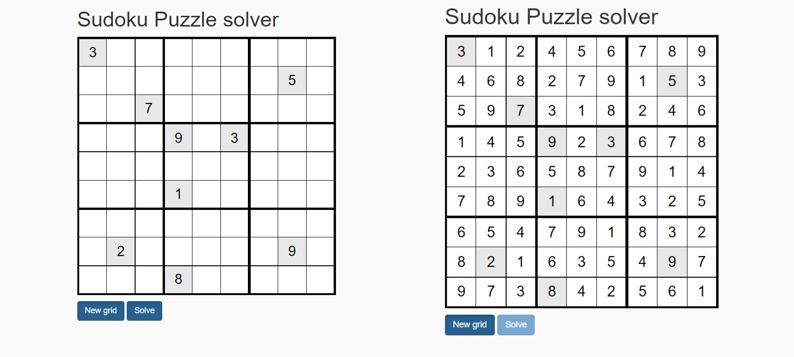

# Sudoku Solver

In this repository, we find a tool develop in javascript to solve a sudoku puzzle.

# Table of contents

- [Algorithm](#algorithm)
- [General](#general)
- [Controle value in row](#getting-started)
- [Controle value in column](#Controle-value-in-column)
- [Controle value in bloc](#Controle-value-in-bloc)
- [Impossible puzzle](@Impossible-puzzle)
- [The solver](#the-solver)
- [Impossible puzzle](#Impossible-puzzle)
- [Testing](#Testing)
- [Contribution](#Contribution)




## Algorithm

The goal of Sudoku is to full a 9x9 grid where each row, column and 3x3 region contains each of the numbers from 1 to 9.

### General

To resolve a sudoku we use the backtracking algorithm. Our Sudoku solver only needs to follow three strategies:

1. If a grid cell has only one possible value, place that value there.
2. if a grid cell has more than one possible value, place the first one
3. If neither 1 or 2 is true in the entire grid, make a guess. Backtrack if the Sudoku becomes unsolvable.

In our algorithm, three main functions are used in the solver.
#### Controle value in row :

This function check if a value is possible in row

```js
function isValueNotExistInLine(value, lineNumber) {

    for (let j=0; j < 9; j++) {
        if (value == this.cells[lineNumber][j]) {
            return false;
        }
    }

    return true;
}
```

#### Controle value in column :

This function check if a value is possible in column

```js
function isValueNotExistInColumn(value, columnNumber) {
    for (let i=0; i<9; i++) {
        if (value == this.cells[i][columnNumber]) {
            return false;
        }
    }

    return true;
}
```

#### Controle value bloc :

This function check if a value is possible in bloc 3x3

```js
function isValueNotExistInBloc(value, lineNumber, columnNumber) {

    const kline = 3 * Math.trunc(lineNumber/3);
    const kcolumn = 3 * Math.trunc(columnNumber/3);

    for(let i=kline; i < kline + 3; i++) {
        for (let j=kcolumn; j < kcolumn + 3; j++) {
            if (value == this.cells[i][j]) {
                return false;
            }
        }
    }

    return true;
}
```
#### The solver : 

The function accept two parameter. The index of line and the index of column. We begin by the pair(0, 0).

```js
function solve(row, column) {
    //the stop condition
    if (8 == row && 9 == column) return true;

    if (column == 9) {
        row++;
        column = 0;         
    }

    if (0 != this.cells[row][column]) {
        return this.solve(row, column + 1);
    }

    for (let number = 1; number < 10; number++) {
        
        if (this.isValueNotExistInBloc(number, row, column) && this.isValueNotExistInColumn(number, column) 
        && this.isValueNotExistInLine(number, row)) {
            this.cells[row][column] = number;

            if (this.solve(row, column +1)) {
                return true;
            }
        }

        this.cells[row][column] = 0;
    }

    return false;
}
```

### Impossible puzzle

There are a lot of Soduku puzzle impossible to resolve like the two grid above :


## Features :

- Detect unsolved sudoku puzzle
- calculating the execution time
- The number of recurescive function calls
- The maximum call depth

## Testing : 

```
npm install
```

```
npm run test
```
## Contribution :

Feel free to submit issues and enhancement requests.

Please refer to each project's style and contribution guidelines for submitting patches and additions. In general, we follow the "fork-and-pull" Git workflow.

1. Fork the repo on GitHub
2. Clone the project to your own machine
3. Commit changes to your own branch
4. Push your work back up to your fork
5. Submit a Pull request so that we can review your changes

NOTE: Be sure to merge the latest from "upstream" before making a pull request!

## Licencse :
